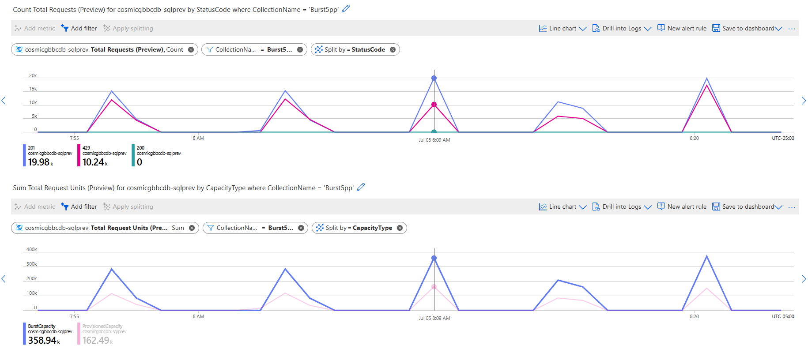
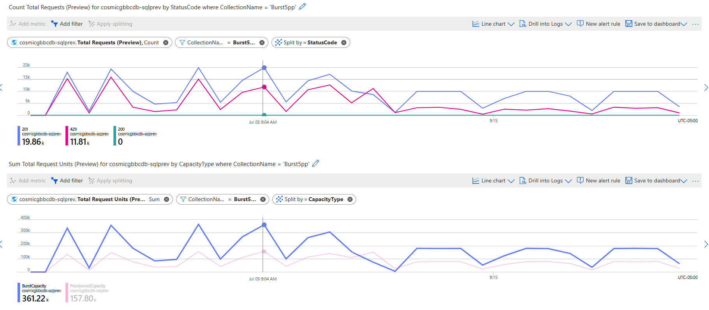
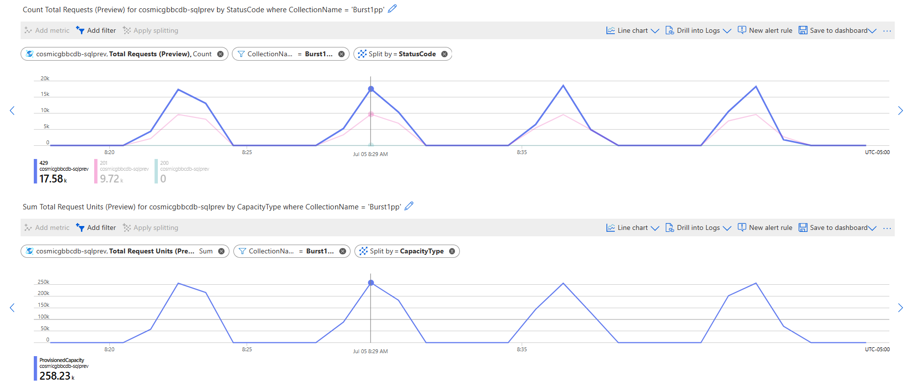

# Burst Capacity - Azure Cosmos DB

Experiments with Cosmos DB Burst Capacity.   
Code: https://github.com/luticm/cosmosdb/tree/main/code/dotnet/PartitionDesign (option 3) 
Docs: https://learn.microsoft.com/en-us/azure/cosmos-db/burst-capacity 
Client application and Cosmos DB account are in the same region  

## 4000 RUs provisioned in a container with 5 physical partitions.  
Run with 5 minute interval between executions (2 threads inserting 10K documents each).  

Batch completed consistently around 30~35 seconds for both threads. 
Metrics from Azure Portal:  

The image shows spike in RU utilization and is noticeable the amount of RUs used by capacity type "BurstCapacity", as each physical partition accumulated RUs to be used by burst. Throttling still happen, but interesting to notice that the accrued capacity was used and utilization was higher than the actual provisioned capacity. 

Even if the workload is modified to occur every minute, the same behavior is observed with RU being accumulated and then bursted in next minute usage.  

## 4000 RUs provisioned in a container with 1 physical partition.  
Run with 5 minute interval between executions (2 threads inserting 10K documents each).  

Batch completed consistently around 106~115 seconds for both threads. 
Metrics from Azure Portal:  

The image shows spike in RU utilization, but noticeable is the amount of RUs used by capacity type "BurstCapacity" is always zero, as a single partition with 4K RUs goes above the 3K limit for burst capacity to be used.  

## Conclusion
This shows an interesting example where two collections with same RU configuration can behave differently. In this case, the collection with 5 physical partitions was able to use the burst capacity more efficiently than the collection with 1 physical partition, that was operating beyond the 3000 RU limit for burst. 
While there are no guarantees on the usage of burst capacity and this synthetic workload was crafted to maximize burst effectiveness, it is important to understand Cosmos DB burst capacity details and how you can potentially leverage that in your environment.  